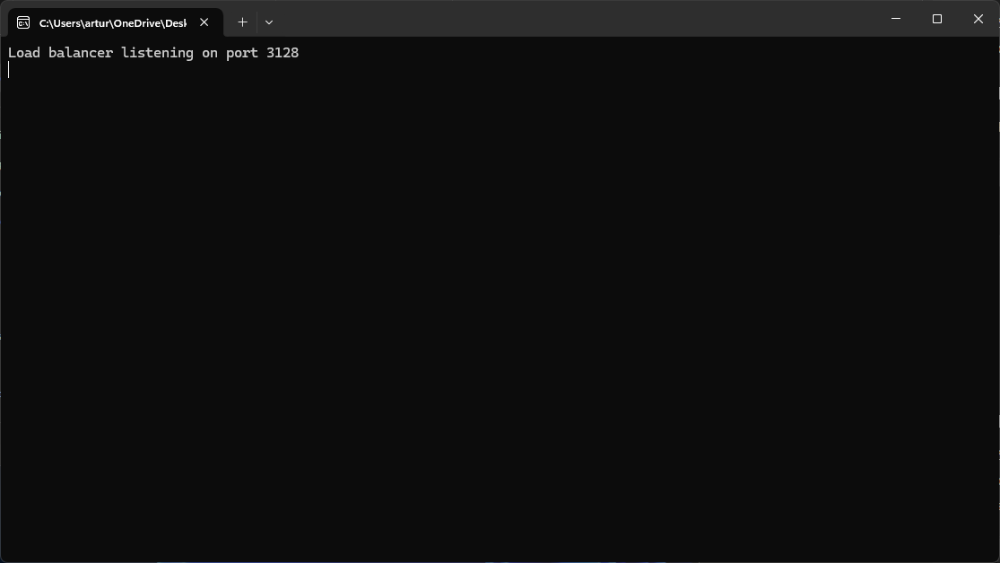
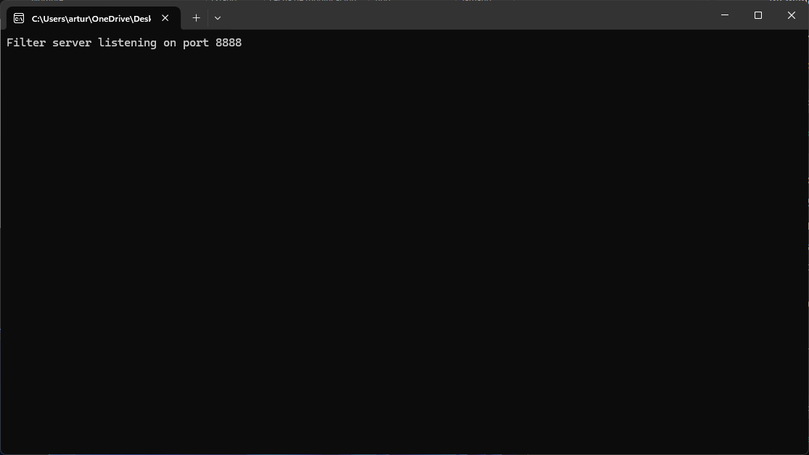
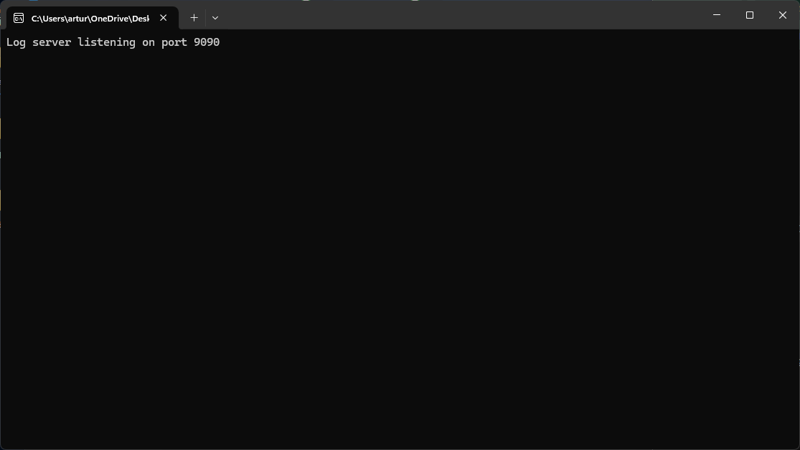
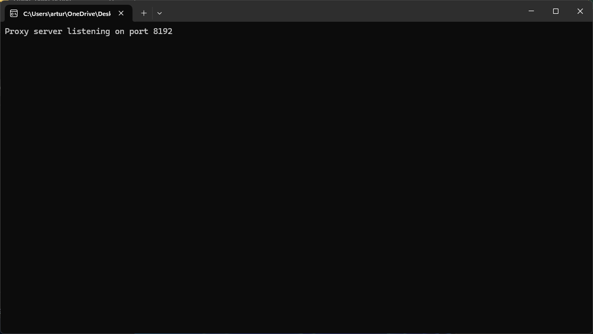
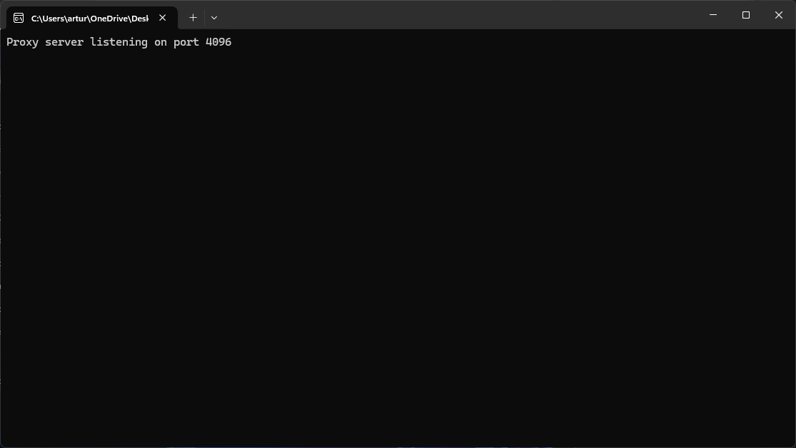
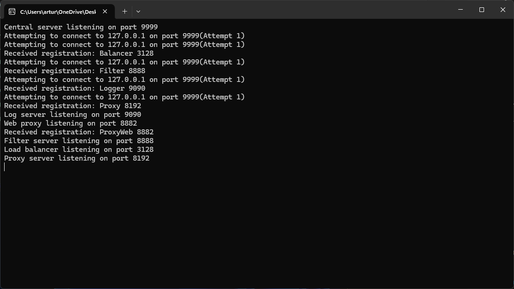

# Proxy System Installation and User Guide

## Setup Required: Installing Curl Library

To ensure proper functionality, you need to place a `curl` folder in two specific locations:

1. **Main Proxy Project Folder:**
   Place a `curl` folder at the root directory of your Proxy project.

2. **Load Balancer Module:**
   Additionally, place a `curl` folder within the Load Balancer module directory.

The `curl` folder should contain necessary libraries and files required by the program. This setup is crucial for enabling network operations and ensuring seamless integration with external services.

Please ensure that the `curl` folder is correctly configured and accessible by the respective modules of the Proxy system.

Additionally, the following directories and files must be present within your project structure:

**loadBalancer/curl/curl/lib/libcurl.a**

**loadBalancer/curl/curl/lib/libcurl.dll.a**

**/Proxy/loadBalancer/curl/curl/include**

**/Proxy/loadBalancer/curl/curl/lib**

## Introduction

This program is designed to run on Windows using Winsock. It consists of the following components:

- 2 Proxies
- 1 Centralized Server
- Load Balancer
- Web Filter
- Web Proxy
- Log Server

## Port Definitions

Each program component uses a specific port:

- Load Balancer: 3128  
  
- Web Filter: 8888  
  
- Log Server: 9090  
  
- Proxy: 8192  
  
- Web Proxy: 8882  
   // This is a prototype of exe file
- Centralized Server: 9999  
  

## About the Project

This proxy system is programmed in C++. I have provided a CMake file to load all the necessary configurations. This is my first major project, and I'm excited to share it with the programming community.

I used CLion to develop this code, but if you use another IDE, please check the `CMakeLists.txt` file in each software module. For example, the Load Balancer has its own `CMakeLists.txt` file, and you might need to modify some settings to make the program work. If you use CLion, you only need to compile the main program, and everything else should work out of the box.

## Functionality

The client connects to a Load Balancer, which then connects to 2 proxies. These proxies send information to a Log Server. The proxies also connect to the internet. A centralized server is implemented to manage all connections on the correct ports.

## License

MrDev25 - All Rights Reserved - 2024

